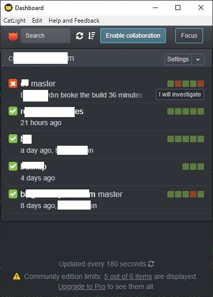
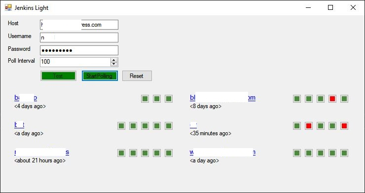

# JenkinsLight
Aşırı Yüksek Bütçeli Jenkins Notifier

Catlight in asiri hasis fiyatlandirma politikasina sinirlendigim icin bir aksamustu implement ettim.

Projenin yaptiklari.
- Kullanici adi ve sifrenizle herhangi bir jenkins serverdaki buildlari poll eder.
- Kullanicinin erisebildigi tum joblari getirir.
- Getirilen joblara ait son 5 buildin statusunu gosterir.
- Patlayan build varsa tray icon rengini kirmiziya cevirir. Evet tray iconun renk degistirmesi gelen maili umursama ihtimalinizden daha yuksek.
- Poll intervali cok kisa tutmayin serverin da cani var. 60 veya 120 saniye iyidir.

Guvenlik Endiseleri
- Veritabaninda dosyada veya registry uzerinde herhangi bir bilgi saklamaz. 3. bir servera bilgi gondermez.
- Jenkins serveriniz tls kullanmiyorsa parolanizi middle manlere kaptirabilirsiniz. Gerci bu uygulama olmasaydi da kaptirabilirdiniz.

Bugfix ve bakim

- Bug bulursaniz kendiniz fixleyebilir. Kendi ihtiyaciniza gore egip bukebilirsiniz. Isterseniz pull request gonderin, belki bir ara bakarim.
- Ben bunu cok sevdim diyorsaniz haber verin sohbet edelim. Malum pandemi falan insana ac kaldik.

Screenshot

Guzel gorunen ama pahali catlight

Fonksiyonel ama grafik yoksunu jenkinslight

Lisans

- WTFPL ile lisansladim. Turkceye cevirirsek pasa gonlunuz ne isterse onu yapin.

Open source dunyasina verdigim bu sacma katkidan dolayi catlight a tesekkur ederim.
